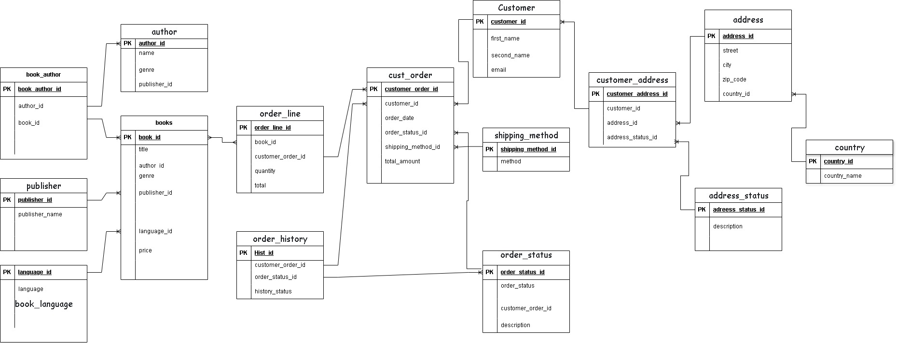

# 📚 Bookstore Database Design & SQL Programming

## 📌 Overview

This project involves the design and implementation of a **MySQL relational database** for a fictional bookstore. It simulates a real-world system for managing books, authors, customers, orders, shipping methods, and more. The goal is to create an efficient, normalized database schema and apply SQL programming skills including table creation, querying, and user access management.

## 🛠️ Tools and Technologies

- **MySQL**: Relational Database Management System (RDBMS)
- **Draw.io (diagrams.net)**: For visualizing the Entity-Relationship Diagram (ERD)
- **GitHub**: For version control and collaboration

## ✅ Prerequisites

To successfully use or build upon this project, you should be familiar with:

- SQL Basics (DDL, DML)
- Creating tables and defining relationships
- Managing users and privileges in MySQL
- Normalization and relational database design

---

## 🎯 Project Objective

Design a robust MySQL database schema that can:
- Store information about books, authors, and publishers
- Manage customer information and addresses
- Handle customer orders and shipping methods
- Track order statuses and history
- Secure data through role-based user permissions

---

## 🧱 Schema Structure

The project follows a **normalized relational schema** with multiple entity relationships.

### Key Tables and Relationships

| Table | Description |
|-------|-------------|
| `book` | Stores information about books |
| `author` | Author details |
| `book_author` | Many-to-many mapping between books and authors |
| `publisher` | Book publishers |
| `book_language` | Languages available for books |
| `customer` | Customer personal details |
| `address`, `customer_address` | Address management and customer-address mapping |
| `country` | Country lookup for addresses |
| `address_status` | Status of customer addresses (current/old) |
| `cust_order` | Customer order records |
| `order_line` | Line items (books) within orders |
| `shipping_method` | Methods used to ship orders |
| `order_status`, `order_history` | Order tracking and status logs |

---

## 🧪 How to Test the Database

1. Import the SQL script (`schema.sql`) into your MySQL server.
2. Run `SELECT` queries to test table creation and relationships.
3. Insert sample data using `INSERT INTO` statements.
4. Create views or reports to analyze customer orders or popular books.
5. Try role-specific logins to validate permission enforcement.

---

## 🖼️ ERD (Entity-Relationship Diagram)

## Collaborators

Mwangi Wambugu  
Velile Mifi  
Raphael Ochieng'  
